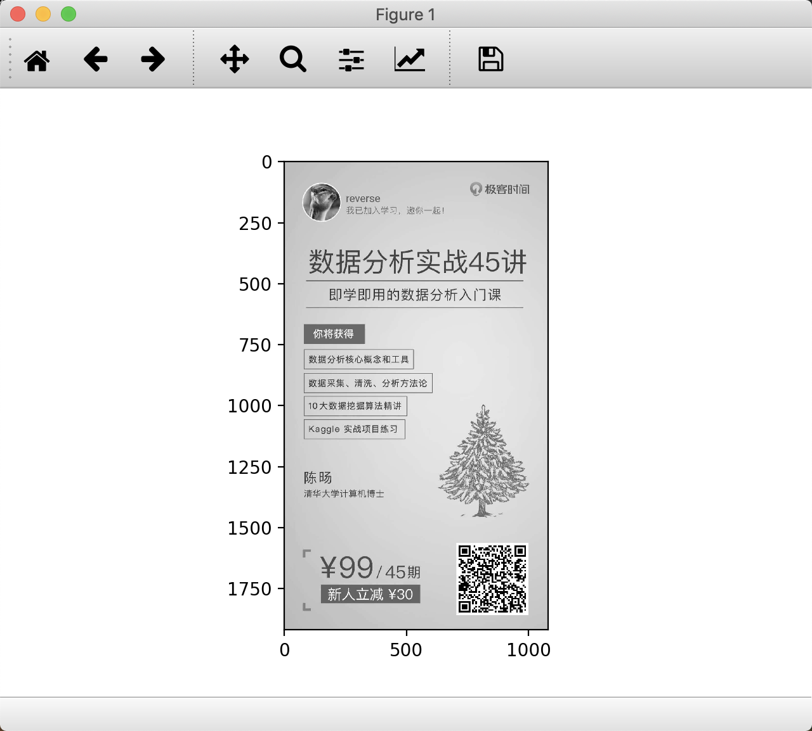
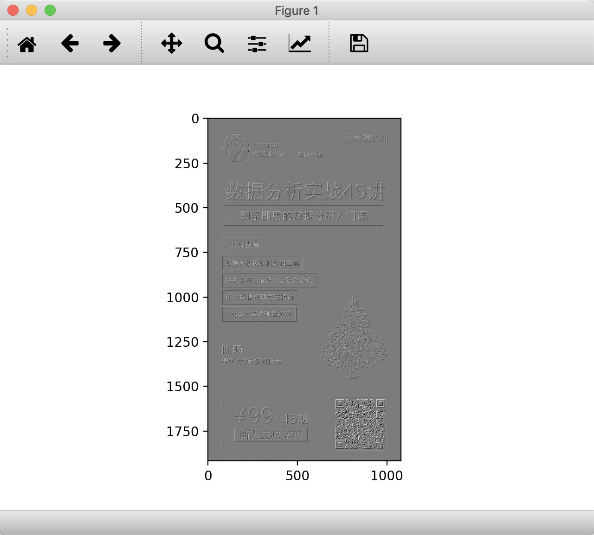

43丨深度学习（下）：如何用Keras搭建深度学习网络做手写数字识别？

## 理解卷积的作用
### CNN 网络结构

* 卷积层
* 池化层
* 全连接层

### 什么是卷积？

假设有下面的一张图


1. 翻转矩阵180度

> 至于为什么，客官请看知乎这篇文章: [链接1][]

2. 卷积运算


3. 重复第二步骤 得到结果


使用代码进行总结

[点我](demo.py)

4. 图像卷积

[代码](demo1.py)

效果：





实际上每个卷积都是一种滤波器 筛选符合条件的部分 类似特征提取

卷积层可以有多个卷积核 例如第一层含有6个可以提取6个特征 得到6个特征图

## 特征函数的作用

卷积操作的下一步， 回归函数 `Sigmoid` 在机器学习中有广泛的应用

`tanh`、`ReLU` 都是常用的激活函数。

## 池化层的作用

- 位置： 通常位于两个卷积层之间
- 作用： 对神经元的数据做降维处理
- 目的： 降低整体计算量


tanh、ReLU 都是常用的激活函数。

## 全连接层的作用

将前面一层的输出结果与当前层的每个神经元都进行了连接

计算出来的特征 -> 分类器

比如 `Softmax` 分类器。在深度学习中，`Softmax`比较实用

## `LeNet` 和 `AlexNet` 网络

通常我们可以使用多个卷积层和池化层，最后再连接一个或者多个全...
LeNet 提出于 1986 年，是最早用于数字识别的 CN...

AlexNet 在 LeNet 的基础上做了改进，提出了更深...

## 常用的深度学习框架对比

.

## 用 `Keras` 做 `Mnist` 手写数字识别
使用 `Keras` 之前，我们需要安装相应的工具包

`Keras` 需要用 `tensorflow` 或者 `theano` 作为后端

### 创建蓄贯模型

```python
from keras.models import Sequential
model = Sequential()


```
### 创建二维卷积层

使用 `Conv2D(filters, kernel_size,activation=None)` 进行创建

`filters` 代表卷积核的数量

`kernel_size` 代表卷积核的宽度和长度

`activation` 代表激活函数

是第一个卷积层，我们还需要提供 `input_shape` 参数

### 对 `2D` 信号做最大池化层

MaxPooling2D(pool_size=(2, 2))...
`pool_size` 代表下采样因子
### 创建 Flatten 层

使用 `Flatten()` 创建

### 创建全连接层

使用 Dense(units, activation=Non...

model.compile(loss, optimizer=‘adam’, metrics=[‘accuracy’]) 来完成损失函数和优化器的

### 示例代码

 [点我](demo3.py)

## 总结


[链接1]: https://cloud.tencent.com/developer/article/1366358 "什么！卷积要旋转180度？！"
